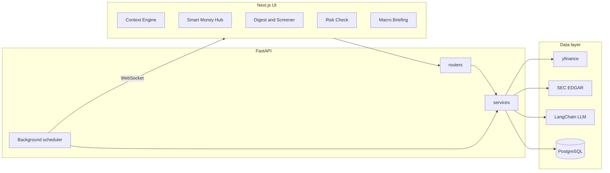

# TradeSentinel AI — Architecture

Technical overview of how TradeSentinel AI is structured and how data flows through the system.

For product features see [product-description.md](product-description.md). For operations see [runbook.md](runbook.md).

---

## Monorepo layout

```
trade-sentinel-ai/
├── apps/
│   ├── api/                         # FastAPI backend
│   │   ├── src/trade_sentinel_api/
│   │   │   ├── main.py              # App entry, router registration
│   │   │   ├── config.py            # Settings (LLM, SEC, valuation, smart-money)
│   │   │   ├── routers/             # HTTP + WebSocket routes
│   │   │   ├── models/schemas/      # Pydantic models (split by domain)
│   │   │   ├── services/            # Business logic
│   │   │   └── storage/             # Postgres / SQLite repositories
│   │   ├── prompts/                 # Versioned LLM prompt templates
│   │   ├── scripts/                 # SEC bulk ingest utilities
│   │   └── tests/                   # pytest (67+ test modules)
│   └── web/                         # Next.js 15 frontend
│       └── src/
│           ├── app/                 # App Router pages
│           ├── components/          # UI cards and panels
│           ├── lib/api.ts           # API client
│           └── hooks/               # WebSocket job updates
├── docker/postgres/init.sql         # DB schema
├── docs/                            # Documentation
└── scripts/smoke_test.sh            # End-to-end smoke test
```

Package manager: **pnpm** workspace at the root. Python deps managed with **uv** in `apps/api/`.

---

## Request flow



Typical path for a ticker context request:

1. `GET /api/v1/context/{ticker}` hits `routers/context.py`
2. Router calls `services/context/builder.py` to assemble a `TickerContext`
3. Builder fans out with `asyncio.gather` to valuation, fundamentals, SEC, insider, options, macro overlay services
4. Results are cached (see below) and returned as a Pydantic schema
5. Optional `POST /{ticker}/summarize` or `GET /{ticker}/stream` invokes `services/llm.py` with facts JSON + versioned prompt

---

## Key service packages

| Package | Responsibility |
|---------|----------------|
| `services/context/` | Context builder — orchestrates all per-ticker data into `TickerContext` |
| `services/valuation/` | Fair-value band, DCF, margin of safety, ETF/fund path |
| `services/sec/` | EDGAR access — Form 4, filings, 13F, 13D/G, N-PORT |
| `services/smart_money/` | Market-wide feeds, scans, GEX, activist alerts |
| `services/macro/` | Economic calendar, briefing assembly, sector mapping |
| `services/digest/` | Watchlist digest rows and screener filters |
| `services/scheduler/` | Background job lifecycle, warm caches, status |
| `services/llm.py` | LangChain provider factory, prompt registry, parse/validate |
| `storage/` | Repository layer — journal, watchlists, context cache, SEC index |

Routers are thin; business logic lives in services. Schemas in `models/schemas/` are split by domain (`context.py`, `valuation.py`, `smart_money.py`, etc.) for maintainability.

---

## Caching strategy

| Layer | What | TTL / notes |
|-------|------|-------------|
| In-memory L1 | Hot context responses | ~15 min TTL |
| PostgreSQL `context_cache` | Serialized `TickerContext` JSON | Keyed by ticker + options hash; survives restarts |
| SQLite fallback | Same tables when `DATABASE_URL` unset | Files under `apps/api/.cache/` |
| SEC filing excerpts | Parsed 8-K / 10-Q text | 7-day cache |
| Smart Money feed | Market-wide Form 4 index | Configurable (`SMART_MONEY_FEED_CACHE_MINUTES`, default 30) |
| Digest | Daily watchlist rows | Per-day cache with concurrency limits |

Cache keys include version suffixes when prompt or schema versions change (e.g. `:v17`), so stale LLM output is not served after upgrades.

---

## Background scheduler

`services/scheduler/` runs periodic jobs to warm expensive endpoints before the user opens them:

- Watchlist digest build
- Screener preset refresh
- Smart Money feed ingestion

Job state is exposed via `GET /api/v1/jobs/status`. Progress and completion events are pushed to the frontend over `WebSocket /ws`, consumed by `JobUpdatesProvider` in the Next.js app.

Manual refresh: `POST /api/v1/jobs/refresh` or per-job `POST /api/v1/jobs/retry/{job_name}`.

---

## LLM pipeline

TradeSentinel uses **facts-grounded prompts**, not vector RAG:

1. Services assemble deterministic JSON facts (fundamentals, valuation, insider, options, macro overlay, etc.)
2. A versioned prompt template (`apps/api/prompts/context_v*.txt`, `macro_v*.txt`) instructs the model to cite only provided facts
3. `services/llm.py` selects the provider from `.env` (OpenRouter, Ollama, DashScope, OpenAI, Anthropic)
4. Response is parsed and validated against Pydantic schemas; malformed output falls back gracefully

Prompt versions are bumped when output structure changes. The prompt registry (`services/llm.py` + tests in `tests/llm/`) maps feature flags to the active template.

---

## Data ingestion

| Source | Integration |
|--------|-------------|
| yfinance | Primary market data — price, fundamentals, options, earnings |
| SEC EDGAR | `edgartools` adapter + custom HTTP client; User-Agent from `SEC_USER_NAME` / `SEC_USER_EMAIL` |
| Bulk 13F / N-PORT | `apps/api/scripts/ingest_sec_13f_bulk.py`, `ingest_sec_nport_bulk.py` |
| Finnhub / FRED / NewsAPI | Optional enrichment when API keys are set |

External calls use `httpx` with timeouts. Failures degrade to partial context with explicit gap messages in the UI.

---

## Database schema

PostgreSQL (Docker) stores:

- **watchlists** — saved tickers per list name
- **trade_journal** — risk-check history
- **context_cache** — serialized analysis payloads
- **sec_index** — local SEC filing index for fast lookups

Init SQL: `docker/postgres/init.sql`. Repositories in `storage/` abstract connection handling; `storage/connection.py` supports both Postgres and SQLite.

---

## Frontend architecture

Next.js 15 App Router with client components for interactive pages. Key patterns:

- `lib/api.ts` — typed fetch wrappers for all `/api/v1` endpoints
- `hooks/useJobUpdates.ts` — WebSocket subscription for scheduler events
- Page-level data fetching in `useEffect` or on user action (no SSR data layer — API is localhost)
- Dark-mode-first Tailwind UI with domain-specific cards (`ValuationCard`, `SecFilingsPanel`, `SmartMoneySection`, etc.)

Routes map 1:1 to product modules — see [apps/web/README.md](../apps/web/README.md).

---

## Testing and CI

| Tool | Scope |
|------|-------|
| **pytest** | 67+ test modules across context, valuation, SEC, smart money, macro, LLM parse, scheduler |
| **ruff** | Python linting |
| **Vitest** | Frontend unit tests (where present) |
| **GitHub Actions** | `.github/workflows/ci.yml` — `uv run pytest -q -m "not live"` + ruff; separate job with Postgres service |

Live tests (`-m live`) hit a running API and are excluded from CI. Smoke test script: `scripts/smoke_test.sh`.

---

## Deployment

Three-container Docker Compose stack:

| Container | Port | Role |
|-----------|------|------|
| `postgres` | 5433 (host) | Database |
| `api` | 8000 | FastAPI + scheduler |
| `web` | 3000 | Next.js |

No cloud hosting is required. Only external cost is LLM API usage (~$5–15/month for personal use with OpenRouter mini models).
